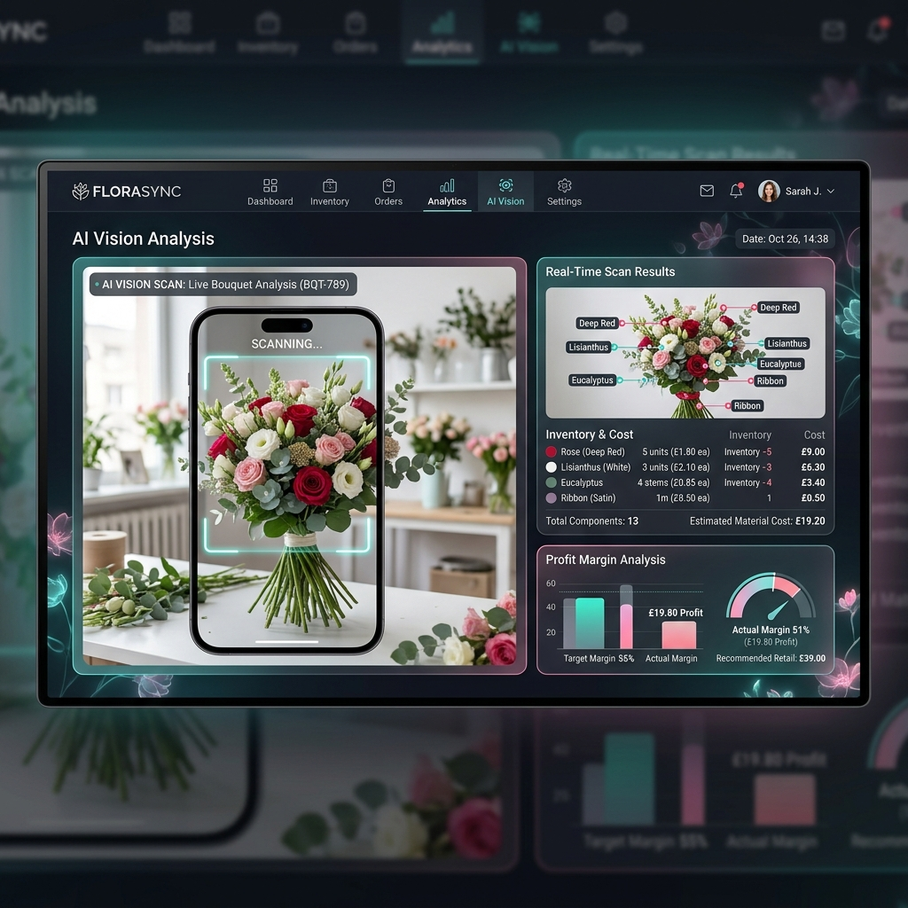
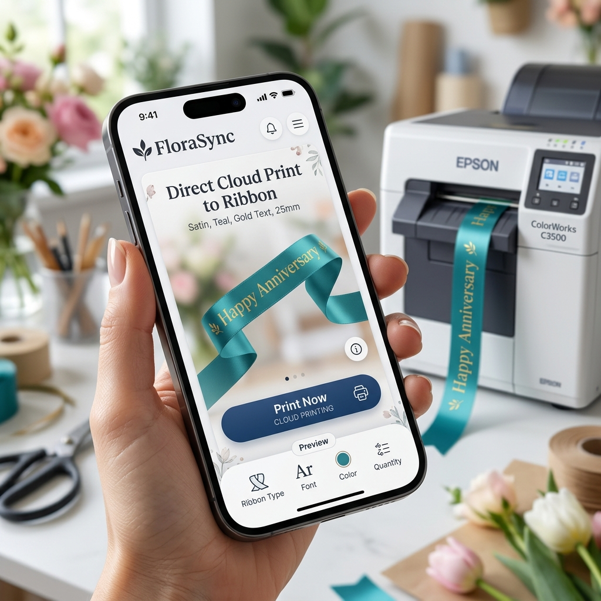
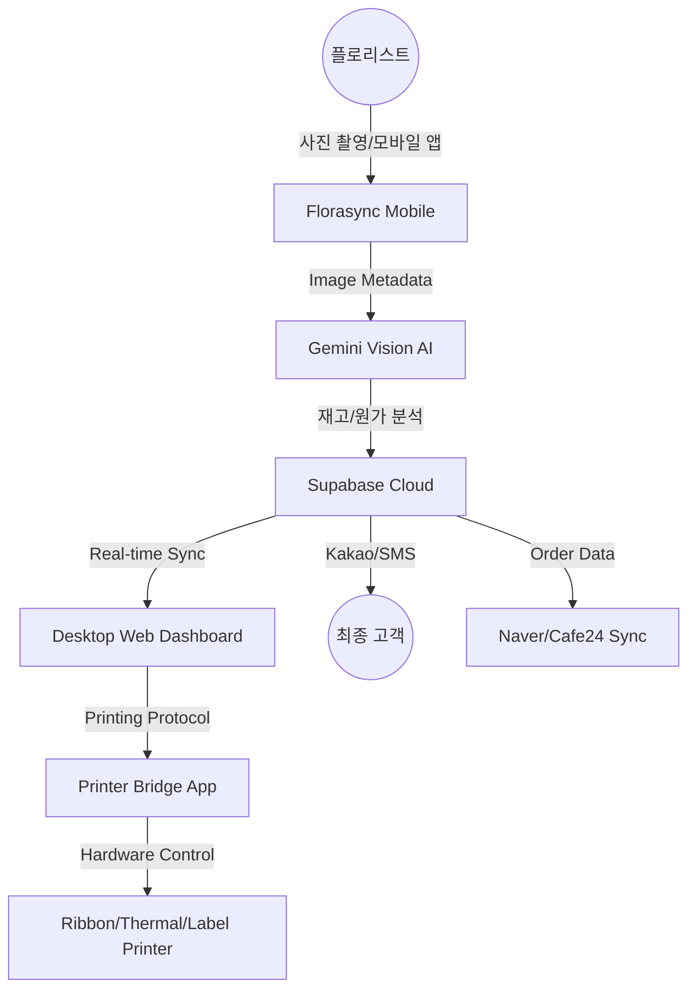

# Florasync (Florasync) : AI-Native Florist Cloud Ecosystem
## 2026 Strategic Business & Technical Report

> [!NOTE]
> **본 보고서는 30년 화훼 도메인 전문성과 최신 AI 기술의 융합을 통한 'Florasync'의 시장 지배력 및 기술적 혁신을 문서화한 자료입니다.**

---

## 1. 사업 비전 : "플로리스트의 두 번째 뇌, 매출을 만드는 SaaS"

Florasync는 단순한 관리 도구가 아닙니다. 1인 매장이 90% 이상인 화훼 산업에서 사장님들이 가장 어려워하는 **원가 관리**, **재고 손실**, **마케팅 부재**를 AI 기술로 자동화하여 실질적인 매출 성장을 견인하는 **AI-Native 플랫폼**입니다.

### 💰 핵심 경제 가치 (Core Economic Value)
- **월간 순수익 기대 상승분:** 약 **+333만원** (표준 소매점 기준)
- **투자 대비 수익률 (ROI):** **34배** (월 5만원 구독 시 가치 창출액 기반)
- **생산성 혁신:** 일일 수기 작업 2시간 → 시스템 자동화로 **5분** 단축

---

## 2. 시장 기회 및 페인포인트 (Market Opportunity)

전 세계 약 15만 개 이상의 꽃집 중 90% 이상이 디지털 전환(DX)의 사각지대에 놓여 있습니다.

### 🚩 기존 시스템의 한계점
1. **정적인 레시피:** 꽃은 공산품과 달리 매번 구성이 달라 재고 관리가 불가능함.
2. **폐기 손실 (Shrinkage):** 유통기한이 짧은 생화의 특성상 월평균 25만원 이상의 폐기 발생.
3. **인쇄 장비의 복잡성:** 하드웨어 드라이버 설치와 용지 규격 설정에 너무 많은 피로도 소요.

---

## 3. 핵심 혁신 기술 (Key Innovation)

### 3-1. AI Vision 기반 실시간 원가/재고 관리

> [!IMPORTANT]
> **Gemini Vision API**를 활용하여 상품 완성 사진 촬영 즉시 사용된 소재의 종류와 수량을 인식합니다.
> - **자동 재고 차감:** 사진 분석 결과가 실시간으로 재고 DB에 반영.
> - **다이내믹 원가 계산:** 시세와 연동된 소재별 원가를 즉시 산출하여 마진율 확보.

### 3-2. 전 세계 어디서든 클라우드 인쇄 (Anywhere Cloud Printing)

- **Hardware Agnostic:** 특정 제조사 장비에 국한되지 않고 매장에 있는 기존 프린터(Epson, XPrint 등)를 그대로 사용.
- **Relay System:** 사장님이 배송 중 차 안에서 모바일로 인쇄 버튼을 누르면, 매장 프린터가 즉시 동작하는 비대면 자동화 시스템 구축.

---

## 4. 시스템 아키텍처 (Architecture)

---

## 5. 글로벌 경쟁 우위 (Competitive Advantage)

Florasync는 미국 FloristWare나 국내 일반 POS 솔루션이 해결하지 못한 **14가지 독점 기능**을 보유하고 있습니다.

| 비교 항목 | 일반 화원 POS | Florasync | 차별화 가용 항목 |
| :--- | :---: | :---: | :--- |
| **레시피 관리** | 정적 리스트 | **AI 가변 레시피** | 사진 한 장으로 원가 분석 (세계 최초) |
| **재고 차감** | 단순 판매 시 | **AI 분석 + 수분 보충** | 생기 유지 소모량까지 자동 계산 |
| **인쇄 방식** | 전용 드라이버 | **Anywhere Cloud** | 모바일/현장에서 원격 인쇄 (세계 최초) |
| **마케팅** | 수동 문자 | **SNS 자동 릴스** | AI가 고객 사진을 릴스로 자동 변환 |
| **글로벌 확장** | 로컬 인쇄 한계 | **하드웨어 무관** | 해외 A4/패널 인쇄 즉시 대응 가능 |

---

## 6. 수익 모델 및 전략 로드맵 (Roadmap)

### 단계별 성장 전략
1. **Phase 1 (Setup):** 2026 Q2 - 국내 핵심 브릿지 연동 및 AI Vision 베타 테스트.
2. **Phase 2 (Growth):** 2026 Q3 - 글로벌 리본/패널 인쇄 스펙 확장 및 자동 결제 연동.
3. **Phase 3 (Expansion):** 2027 H1 - 동남아 8개국(베트남, 태국 등) 현지화 및 글로벌 시장 진출.

> [!TIP]
> **단위 경제(Unit Economics):** LTV(생애 가치) 대비 CAC(고객 획득 비용)가 **10배 이상**으로 설계되어 있어, 매 증가 매장당 높은 수익률을 보장합니다.

---

## 7. 결론

Florasync는 **"꽃 사장님의 삶을 바꾸는 기술"**이라는 철학 위에 세워졌습니다. 장비는 이미 사장님들의 책상 위에 있습니다. 우리는 그 장비들이 AI와 소통하게 하여, 사장님이 오직 **꽃의 아름다움**에만 집중할 수 있는 환경을 만듭니다.

---
**Prepared by Antigravity AI Strategy Team**
*Copyright © 2026 Florasync / Florasync. All Rights Reserved.*
