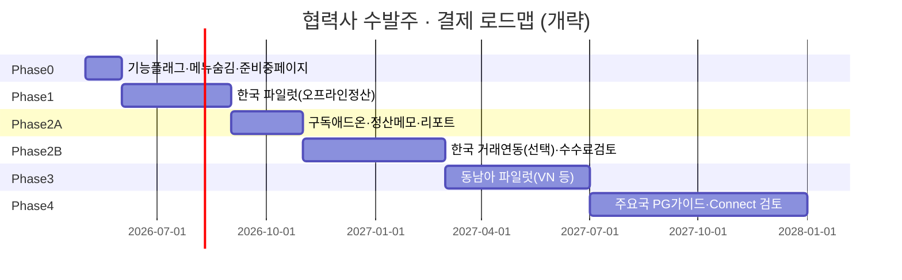

# FloXync 협력사 수발주 · 글로벌 결제 로드맵

> **작성 목적:** 협력사 수발주(Partner / External Orders) 기능을 단계적으로 오픈하고,  
> **본사는 소프트웨어·구독 수익**, **결제는 매장 자체 PG** 원칙을 유지하는 운영·제품 로드맵.  
> **관련 문서:** `docs/implementation_plan.md` (Phase 2 마켓플레이스 수수료), `docs/floxync-manual.html` (준비 중 표기)

---

## 0. 핵심 원칙 (변하지 않는 전제)

| 원칙 | 의미 |
|------|------|
| **본사 = 소프트웨어만** | FloXync HQ는 주문·상태·기록·연동을 제공. 화환 실물·배송 책임은 매장. |
| **돈의 흐름 (1단계)** | 화원 ↔ 화원 **주문 대금은 매장끼리 직접 정산** (계좌이체·매장 PG·세금계산서 등). |
| **본사 수익 (1단계)** | **SaaS 구독 / 애드온** — 거래 건별 %는 PG·법무 준비 후 Phase 2-B. |
| **PG 키** | **각 매장이 자국 사업자로 PG 가입 → 앱에 키 입력** (토스·Stripe 등). FloXync가 국가마다 법인을 둘 **필요 없음**. |
| **글로벌 법인** | 매장 자체 PG 모델에서는 **한국(또는 1곳) 법인으로 SaaS 운영 가능**. 현지 법인은 마켓플레이스 에스크로·현지 직접 청구 시 검토. |

---

## 1. 제품·운영 스위치 (기능 플래그)

런칭 전·베타·전면 오픈을 **코드 배포 없이** 조절하기 위한 2단 스위치.

| 레벨 | 위치 (구현 예정) | 용도 |
|------|-----------------|------|
| **전역** | 슈퍼관리자 `환경설정` (`/dashboard/system-settings`) | `partner_orders_enabled` — 전체 OFF면 모든 매장 메뉴 숨김 |
| **매장별** | 슈퍼관리자 `테넌트 관리` | `partner_orders_beta` — 요청·파일럿 매장만 ON |

**OFF일 때 필수 동작**

- 사이드바·안드로이드 하단 메뉴에서 **협력사 수발주** 숨김
- `/dashboard/external-orders` 직접 접근 → **준비 중** 안내 (404 X)
- 관련 API → 403 또는 `feature_disabled`
- 매뉴얼·랜딩 문구와 **실제 노출 상태 일치**

> 현재(2026-05): 메뉴는 Pro/ERP에 노출, 매뉴얼은 「준비 중」 — 플래그 구현 **Phase 0**에서 정리.

---

## 2. 단계별 로드맵 (타임라인)

### Phase 0 — 비공개 정리 (약 2~4주)

**목표:** 미완성 기능 노출·문의 차단, 개발은 계속.

| 항목 | 내용 |
|------|------|
| 기능 플래그 | 전역 OFF + (선택) 테넌트 베타 플래그 DB/설정 |
| UI | 메뉴 완전 숨김, URL 가드, 「준비 중」 페이지 |
| 문서 | 매뉴얼·사이드바와 상태 일치 |
| 수요 수집 | (선택) 설정에 「베타 신청」 이메일/폼 1줄 |

**완료 기준:** 일반 매장 사용자에게 수발주 메뉴·기능이 보이지 않음.

---

### Phase 1 — 한국 파일럿 (약 2~3개월)

**목표:** 소수 매장(5~15곳)으로 **주문·수주·상태**만 검증. **결제는 앱 밖.**

| 제품 | 내용 |
|------|------|
| 오픈 범위 | `partner_orders_beta` 매장만 |
| 주문 흐름 | 발주 매장 → 수주 매장 수락/거절/제작/완료 |
| 정산 | 앱에 **정산 예정 금액·메모·정산 완료 체크** (실제 송금 X) |
| 협력사 네트워크 | 설정 > 협력사 네트워크(포트폴리오·지역·카테고리) 연동 |
| PG | **없음** (매장끼리 기존 방식: 계좌·카톡·전화) |
| 본사 수익 | 기존 Pro 포함 또는 **「수발주 네트워크」애드온** 파일럿 가격 테스트 |

| 운영 | 내용 |
|------|------|
| 지원 | 파일럿 매장 전담 채널, 주 1회 피드백 |
| KPI | 월 수발주 건수, 완료율, 분쟁 건수, NPS |

**완료 기준:** 파일럿 매장 80% 이상이 「주문 흐름만으로도 업무 가능」 응답.

---

### Phase 2-A — 한국 확대 + 구독 상품화 (약 2개월)

**목표:** 전역 스위치 ON(한국 한정 마케팅), **여전히 오프라인 정산**.

| 제품 | 내용 |
|------|------|
| 오픈 | 한국 `operating_country=KR` 매장 대상 Pro/애드온 |
| 리포트 | 월별 수발주 GMV(기록 기준), 미정산 알림 |
| 분쟁 | 취소·환불 **가이드라인** (앱은 상태만, 환불은 매장 간 처리) |
| 매뉴얼 | 「준비 중」 제거, 온보딩 3분 가이드 |

| 본사 수익 | 권장 |
|-----------|------|
| **애드온** | 예: 월 29,000~49,000원 「협력사 수발주 네트워크」 |
| 또는 | Pro 플랜에 포함 (단가 인상 대신) |

**완료 기준:** 유료 애드온 전환 또는 포함 플랜 유지 결정 + 월 활성 수발주 매장 30곳+.

---

### Phase 2-B — 한국 결제 연동 검토 (약 3~4개월, 선택)

**목표:** 앱 **안에서** 결제까지 원하는 매장만 — **매장 자체 토스(등) 키** 유지.

| 방식 | 설명 | FloXync 현지 법인 |
|------|------|-------------------|
| **A. 정산 링크만** | 수주 매장 결제 URL/QR을 주문에 붙임 (매장 PG) | 불필요 |
| **B. 주문별 결제 요청** | 매장 토스로 결제 링크 생성 API (매장 키) | 불필요 |
| **C. 플랫폼 분할 정산** | FloXync가 중개 + % 수수료 | **필요·PG 심사·약관** |

**권장:** 2-B는 **A → B**만. **C(마켓플레이스 에스크로)** 는 `implementation_plan` 1~3% 수수료와 함께 **법무·회계 확정 후**.

**완료 기준:** B 방식으로 파일럿 3곳 이상 결제 성공 (C는 별도 Go/No-Go).

---

### Phase 3 — 동남아 파일럿 (약 4개월)

**목표:** **베트남 우선** (이미 i18n·regional-keys 기반 있음). 동일 원칙: **오프라인 정산 우선**.

| 국가 | 우선순위 | 매장 PG (자체 키) | FloXync 준비 |
|------|----------|-------------------|--------------|
| **베트남** | 1 | VN PSP (매장 계약) | vi UI, 지역·카테고리, 매뉴얼 VN |
| **태국** | 2 | 현지 PSP | th 메시지 확장 |
| **인도네시아** | 3 | 현지 PSP | id |
| **말레이시아** | 2~3 | 현지 PSP | ms |

| 제품 | 내용 |
|------|------|
| 오픈 | `country` + 베타 플래그 |
| 정산 | 다통화 **표시만** (VND/KRW/USD), 실제 송금은 매장 |
| 배송 | 카카오T 대신 **AHAMOVE 등** (이미 regional-keys 방향) |

**완료 기준:** VN 파일럿 10매장, 월 50건+ 수발주 기록.

---

### Phase 4 — 글로벌 확장 (약 6개월+, 지속)

**목표:** 북미·EU·기타 — **PG 가이드 라이브러리** + 필요 시 Connect.

| 지역 | 매장 PG (자체 키) | FloXync 구독 청구 | 주문 대금 |
|------|-------------------|-------------------|-----------|
| **한국** | 토스페이먼츠 | Stripe/Paddle + 한국 법인 | 매장 직접 / Phase 2-B |
| **미국·캐나다** | Stripe (매장 계정) | Stripe Billing 국제 | 매장 직접 |
| **EU·영국** | Stripe 등 | Paddle MoR 검토 (VAT) | 매장 직접 |
| **일본** | Stripe JP / 현지 | 구독 Stripe | 매장 직접 |
| **호주·NZ** | Stripe | Stripe | 매장 직접 |

**Phase 4-C (장기, 선택):** Stripe Connect 등으로 **플랫폼 수수료 1~3%** — HQ 정책·약관·분쟁 프로세스 **별도 프로젝트**.

---

## 3. 국가별 PG · 법인 요약표

| 질문 | 답 |
|------|-----|
| 매장이 자국 PG 키를 쓰면 FloXync가 그 나라에 사업자가 있어야 하나? | **아니요** (매장이 가맹점) |
| FloXync 구독료를 해외 매장에게 받으려면? | **한국 법인 + Stripe/Paddle** 등으로 가능 (국가별 법인 필수 아님, **세무는 별도**) |
| FloXync가 주문 돈을 받아 화원에게 나눠 주려면? | **플랫폼 PG·현지 규제** → 단계적, 국가별 검토 |

---

## 4. 수익 모델 타임라인

| 시기 | 본사 수익 | 화원 간 주문 대금 |
|------|-----------|-------------------|
| Phase 0~1 | 기존 구독 | 오프라인 |
| Phase 2-A | **수발주 애드온** 또는 Pro 포함 | 오프라인 + 앱 정산 기록 |
| Phase 2-B | 동일 + (선택) 결제 연동 수수료 **없음** (PG 수수료는 매장 부담) | 매장 PG 링크/API |
| Phase 4-C | **거래액 1~3%** (계획) | 플랫폼 분할 (법무 후) |

---

## 5. 기술 체크리스트 (엔지니어링)

### Phase 0 (즉시)

- [ ] `lib/feature-flags.ts` — `partnerOrdersEnabled(global)`, `partnerOrdersBeta(tenantId)`
- [ ] `sidebar.tsx`, `android-app-chrome.tsx` 필터
- [ ] `external-orders/**` layout 가드 + Coming Soon 페이지
- [ ] `system_settings` 또는 `platform_features` 키 1개
- [ ] 슈퍼관리자 UI: 환경설정 토글 + 테넌트 베타 체크

### Phase 1

- [ ] 정산 상태: `settlement_status`, `settlement_note`, `settled_at`
- [ ] 수주/발주 알림 (알림톡·푸시는 매장 키)
- [ ] 파일럿 약관·면책 (플랫폼은 중개 도구)

### Phase 2-B (선택)

- [ ] 주문 상세 «결제 링크» 필드 (매장 PG URL)
- [ ] 토스 링크페이 등 **매장 키** 기반 API (기존 설정 > 토스 패턴 재사용)

### Phase 3+

- [ ] `operating_country` 별 기능 플래그
- [ ] 다통화 금액 표시 (`Intl.NumberFormat`)
- [ ] 국가별 온보딩 위저드 (PG 없이도 사용 가능)

---

## 6. 리스크 · Go/No-Go

| 리스크 | 완화 |
|--------|------|
| 미완성 기능 노출 | Phase 0 플래그 |
| 화원 간 분쟁·환불 | 약관: FloXync는 기록·도구만, 당사자 간 해결 |
| 글로벌 PG 통합 과도 투자 | 오프라인 정산 우선, Connect는 GMV·수요 확인 후 |
| 본사 자금 관여 오해 | UI·매뉴얼에 「결제는 매장 간 직접」 명시 |
| 세무(VAT/GST) | 구독은 Paddle/회계사 검토, 거래 %는 별도 |

**Go/No-Go (Phase 2-B → C 진입 전)**

- 월 수발주 GMV (기록) ≥ 목표 (예: 한국 5천만 원 equivalent)
- 분쟁률 < 2%
- 법무: 플랫폼 약관·개인정보(제3자 제공) 검토 완료

---

## 7. 지금 당장 할 일 (추천 순서)

1. **Phase 0** 기능 플래그 + 메뉴 숨김 (1~2주)
2. 파일럿 매장 5곳 리스트 + 베타 플래그 ON
3. **Phase 1** 정산 메모·상태만으로 2~3개월 운영
4. 애드온 가격·약관 확정 (Phase 2-A)
5. 한국 PG **링크 방식**만 검토 (Phase 2-B-A)
6. VN 파일럿 (Phase 3) — 동남아 수요 있을 때

---

## 8. 문서·코드 참조

| 항목 | 경로 |
|------|------|
| 수발주 UI | `src/app/dashboard/external-orders/` |
| 사이드바 메뉴 | `src/components/layout/sidebar.tsx` |
| 슈퍼관리자 환경설정 | `src/app/dashboard/system-settings/page.tsx` |
| 마스터 수익·본사 역할 | `docs/implementation_plan.md` §2, §3 |
| 매뉴얼 (준비 중) | `docs/floxync-manual.html` `#nav-external-orders` |

---

*이 로드맵은 제품·사업 판단용이며, PG·세무·자금이전 관련 최종 결정은 법무·회계 자문 후 반영하세요.*
